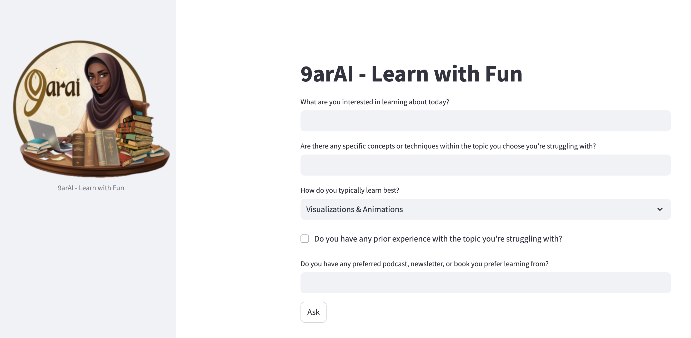
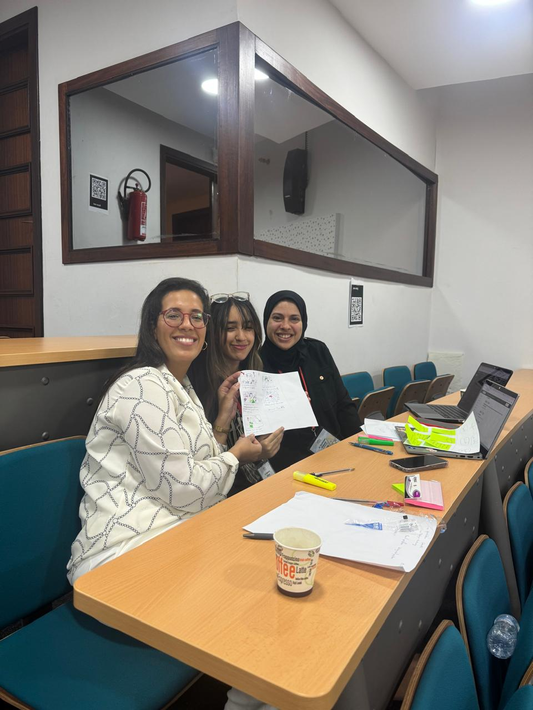

# 9arAI - Your Personalised Learning Assistant 

This is an AI assistant that helps you understand difficult to absorb information by making the process fun. Based on your favorite learning styles, it gives you suitable form of content to watch to understand a concept, it gives you books, podcasts, videos and text.

Built as part of the AI Summer School 2024 - Al Akhawyen - Design Thinking Workshop!

## About this project

9arAI, is a revolutionary application that leverages artificial intelligence to address the diverse challenges of modern education. 9arAI analyzes individual student preferences, performance, and needs to recommend the most effective educational resources, whether in videos, texts, or interactive quizzes. By tailoring content to each student's unique learning style, we aim to make education more accessible, engaging, and effective, helping every learner reach their full potential.

**Storyboard**

**Tech stack**

Developped using:

- **Google AI Studio:** for prototyping and testing conversational model
- **Streamlit:** for UI

**Team**

Get to know the Lazies:

- **Sara El-Ateif**: Dr. in CS, thesis in "Multimodality learning for medical diagnosis", a multi-passionate curious creative with a mission to demistify AI to inspire change.
- **Basma Esserkassi**: Enthusiastic and versatile biomedical engineer, deeply interested in bioinformatics and AI.
- **Nissrine Haida**: Cute Al Akhawyen Student.

**Video - Pitch**

